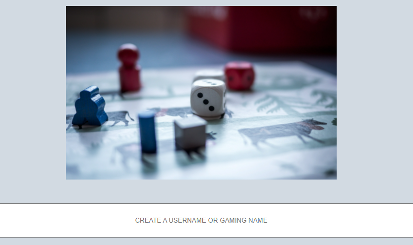
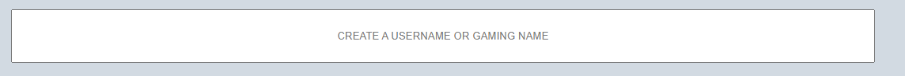
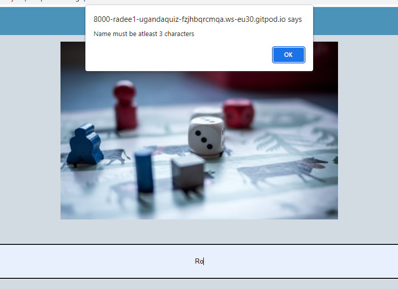
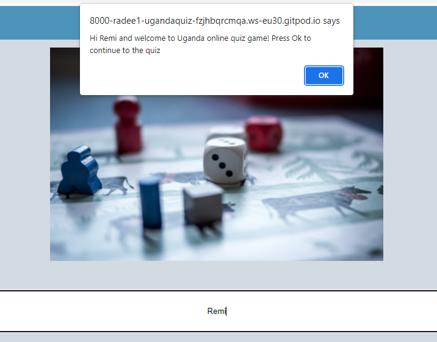
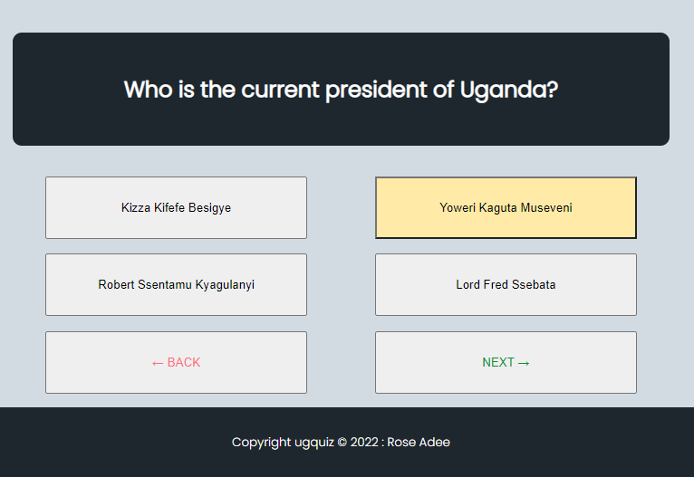
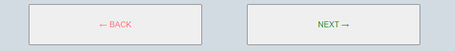
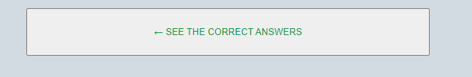
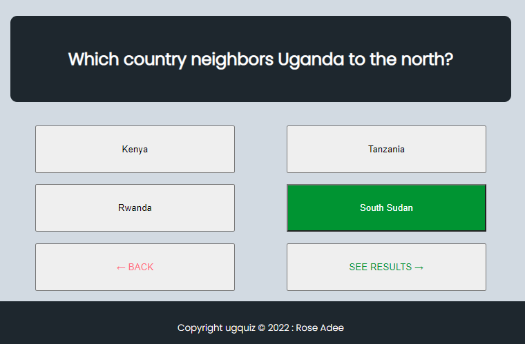
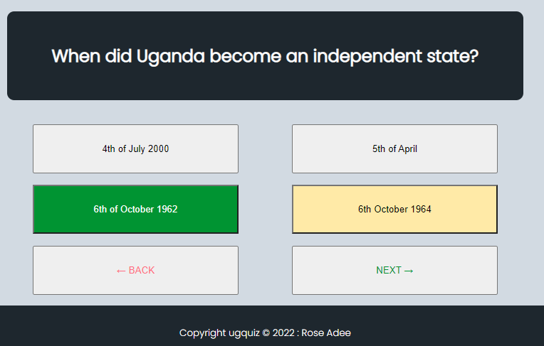

# **The UG Quiz**

The UG quiz is an online quiz about Uganda. It is written in pure HTML, CSS and JavaScript.
The site/program contains two HTML (index.html and page1.html) pages, one CSS file and one JavaScript file.

The UG Quiz is a website that aims to show how pure JavaScript works in a practical setting. The site will be aimed at persons who are interested in not just advanced JavaScript principles, but also history, geography, and a passion for foreign nations, particularly Uganda. The UG Quiz is a completely responsive JavaScript quiz game that allows players to setup usernames or gamer identities, take the quiz, and display their scores.

## Features

This section provides brief descriptions about the existing features of the UG quiz game.

1. **The Navigation Bar**

* The name of the site "UG Quiz" is in the left corner of the navigation bar, and it appears on all six pages of the quiz.

2. **The landing image**

* The hero image is an image of a couple of dices. The image aims to prepare the user mentally to expect to play a game in the form of a quiz.

3. **create username or gamer name**

* The create username also known as the gamer name feature allows the user to set up a name for which they would like to be identified as in the quiz.

4. **username lenth validation**

* When a user creates their gamer name for the quiz, the site checks whether the input submitted meets the requirements put in place. If the username chosen by the user is less than 3 characters, the site will notify them and the user will not be able to proceed to the quiz.

5. **correct input validation**

* If the user inputs a username with 3 characters or more, the site welcomes them and allows the user to proceed to the UG quiz game.

6. **Selecting a choice of answer**

* On loading the quiz, the UG quiz game allows the user to select or choose an answer from the multiple options presented for each question. There are five questions in total for the quiz and all these questions are presented on their own page.

7. **The Back and Next buttons**

* The quiz has two buttons on each page on which the questions are found. The two buttons back and next, allow the user to easily navigate through the questions and from one page to another.

8. **The See results button**

* After the user selects his or her choice of answers, the page containing the fifth question has a see results button. The see results button calculates the scores and prompts the user to the next page which has the score obtained by the user.

9. **The Score Count**

* The score count feature simply returns the value of correct answers out of a total of the five questions answered by the user.

10. **The correct answers**

* After receiving a score, the site allows the user to view the questions answered correctly. The color green is used to highlight the correct answers in the quiz.

11. **The wrong answers**

* The site allows the user to view the questions failed too. The UG quiz game highlights the answers failed together with the correct answers for the user to use as a learning opportunity.

## Testing
------
* Bugs
The overlapping footer

---

