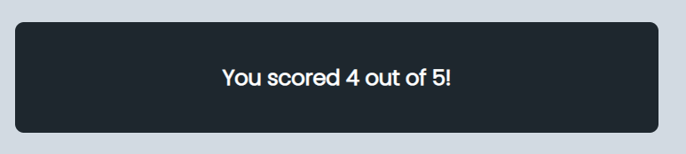

# **The UG Quiz**

The UG quiz is an online quiz about Uganda. It is written in pure HTML, CSS and JavaScript.
The site/program contains two HTML (index.html and page1.html) pages, one CSS file and one JavaScript file.

The UG Quiz is a website that aims to show how pure JavaScript works in a practical setting. The site will be aimed at persons who are interested in not just advanced JavaScript principles, but also history, geography, and a passion for foreign nations, particularly Uganda. The UG Quiz is a completely responsive JavaScript quiz game that allows players to setup usernames or gamer identities, take the quiz, and display their scores.

## Features

This section provides brief descriptions about the existing features of the UG quiz game.

1. **The Navigation Bar**

* The name of the site "UG Quiz" is in the left corner of the navigation bar, and it appears on all six pages of the quiz.

2. **The landing image**

* The hero image is an image of a couple of dices. The image aims to prepare the user mentally to expect to play a game in the form of a quiz.

3. **create username or gamer name**

* The create username also known as the gamer name feature allows the user to set up a name for which they would like to be identified as in the quiz.

4. **username lenth validation**

* When a user creates their gamer name for the quiz, the site checks whether the input submitted meets the requirements put in place. If the username chosen by the user is less than 3 characters, the site will notify them and the user will not be able to proceed to the quiz.

5. **correct input validation**

* If the user inputs a username with 3 characters or more, the site welcomes them and allows the user to proceed to the UG quiz game.

6. **Selecting a choice of answer**

* On loading the quiz, the UG quiz game allows the user to select or choose an answer from the multiple options presented for each question. There are five questions in total for the quiz and all these questions are presented on their own page.

7. **The Back and Next buttons**

* The quiz has two buttons on each page on which the questions are found. The two buttons back and next, allow the user to easily navigate through the questions and from one page to another.

8. **The See results button**

* After the user selects his or her choice of answers, the page containing the fifth question has a see results button. The see results button calculates the scores and prompts the user to the next page which has the score obtained by the user.

9. **The Score Count**

* The score count feature simply returns the value of correct answers out of a total of the five questions answered by the user.

10. **The correct answers**

* After receiving a score, the site allows the user to view the questions answered correctly. The color green is used to highlight the correct answers in the quiz.

11. **The wrong answers**

* The site allows the user to view the questions failed too. The UG quiz game highlights the answers failed together with the correct answers for the user to use as a learning opportunity.

## Testing
------
1. **The functionality of the site**

* The UG Quiz consists of seven pages namely: the index page, president section page, geography section page, independence section page, flag section page, neighbors section page and the results section page. The UG Quiz game has navigation buttons ( back and next), that run across all the pages of the quiz. With these features the user will easily navigate from page to page.

* The index page contains a create username button to encourage users to create ganer names. The create username button chnages color when the user hovers over it. The text chnages to white whereas the button chnages to a darker shade of grey. The users will be able to enter their names of choice. The names should be three characters long to be accepted. When a user tries to access the quiz or submit without first creating a gamer name, the UG Quiz game will notify the user that a name has to be filled in order to gain access the quiz.

* The UG Quiz contains contains five multiple choice questions. The user can select the choice of answer they think is correct. After selecting the desired choices, the UG Quiz game calculates the correct answers and returns the value scored out of the five questions. The UG quiz also allows the user to view the results obtained and compare the answers they submitted to the correct answers of the quiz.

* I have tested the functionality through code inspection and am happy to report that the UG Quiz game features function as intended.

2. **Responsiveness**

* The UG Quiz is responsive to different media devices. Media queries are set for different device views with a maximum width of 768 pixels and 600 pixels or below. 

* I have tested the responsiveness of the UG Quiz and therefore, I am happy to report that through code inspection, the UG Quiz responds well to different device views.

3. **Bugs and fixes**

* **Bug 1:** The overlapping footer on larger screens for all the pages

* *FIX 1:* Removing the break tags from the div elements containing the hero image and form. 

* **Bug 2:** Distorted hero image on small size screens.

* *FIX 2:* Fixed the issue by reducing the width of the hero image from initial 50% to 40% for the small screens in the media querries. Also, reduced the margins for the images of the small screens.

## Validator Testing

* HTML

No errors were returned when passing through the official W3C validator

* CSS

No errors were found when passing through the official (Jigsaw) validator

* JavaScript

No errors were found when passing through the official Jshint validator

The following metrics were returned:

There are 31 functions in this file.

Function with the largest signature take 1 arguments, while the median is 0.

Largest function has 13 statements in it, while the median is 6.

The most complex function has a cyclomatic complexity value of 3 while the median is 1.

* Accessibility

The accessibility score for desktop applications using lighthouse is 87.

### Unfixed Bugs

All the errors are fixed.

## Deployment
------
The site was deployed to GitHub pages. The steps to deploy are as follows:

* In the GitHub repository, navigate to the Settings tab

* From the source section drop-down menu, select the Master Branch

* Once the master branch has been selected, the page will be automatically refreshed with a detailed ribbon display to indicate the successful deployment.

* The live link can be found here -

## Credits
--------

1. **Content**

 * The text within the president question section or answers was taken from Wikipedia-https://en.wikipedia.org/wiki/President_of_Uganda

 * The text and information for geography and neighbors section was taken from-https://en.wikipedia.org/wiki/Geography_of_Uganda#:~:text=While%20much%20of%20its%20border,is%20semiarid%20in%20the%20northeast.

 * The text for independence section was taken from-https://en.wikipedia.org/wiki/Independence_Day_(Uganda)

 * the text for flag colors section was taken from-https://en.wikipedia.org/wiki/Flag_of_Uganda

 * The font-family applied in the CSS page, and html header section was adopted from Google fonts- https://fonts.google.com/

 * Adding the link for the favicon- inspired by the love-maths project.

2. **Media**

 * All the images used in the readMe are extracted from the UG Quiz game.

 * Pixabay-https://pixabay.com/images/search/dice/